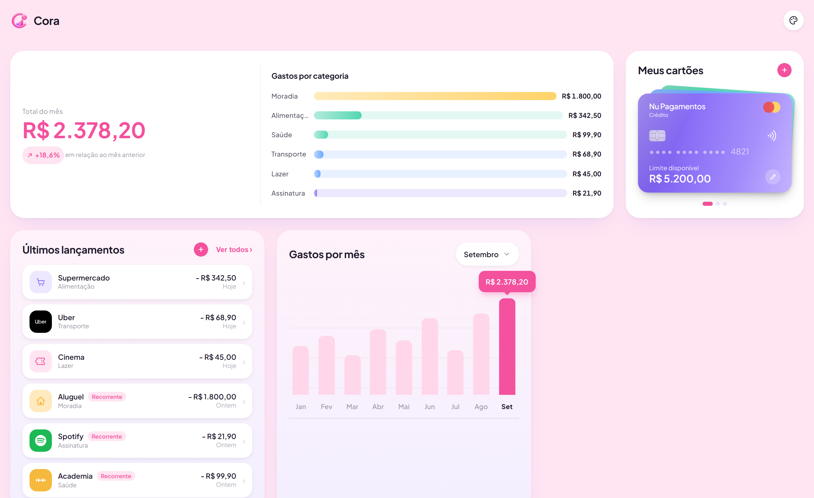
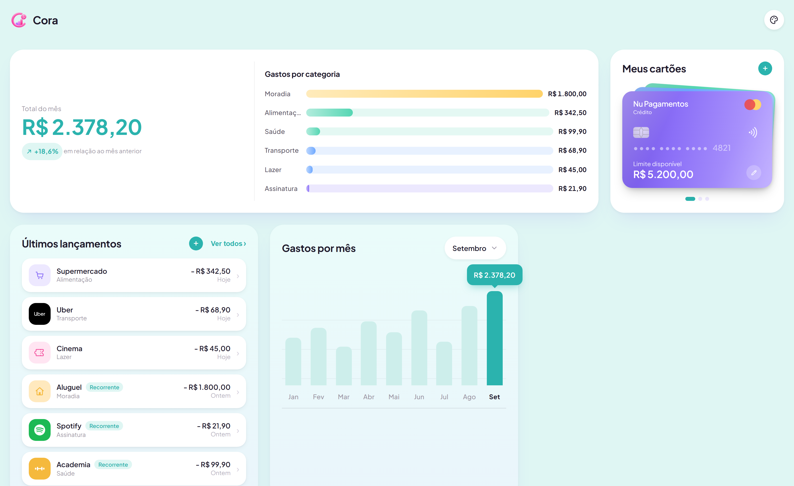

# Cora

Dashboard pessoal de finanças, feito pra acompanhar cartões, gastos do mês e pra onde o dinheiro está indo — sem depender de planilha.

<p align="center">
  
  
</p>

A paleta de cores do app é trocável na hora, direto pelo ícone no canto superior direito.

## O que tem

- Cartões salvos em formato de carteira, com cor e limite editáveis
- Lançamentos do mês com ícone por marca (Netflix, iFood, Nubank...) ou categoria
- Gráfico de gastos por mês e resumo por categoria, sempre calculados a partir dos lançamentos — não tem número solto pra desincronizar
- Tudo salvo em SQLite local, sem serviço externo

## Stack

React + TypeScript + Vite no front, Express + SQLite (`node:sqlite`, nativo) no back.

## Rodando localmente

Requisito: [Node.js](https://nodejs.org/) 22.5 ou mais recente (é a partir dessa versão que o `node:sqlite` existe).

```bash
git clone https://github.com/evelynrporto/Cora.git
cd Cora
npm install
npm install --prefix server
npm run dev:all
```

Isso sobe o frontend em `localhost:5173` e a API em `localhost:3001`. Na primeira vez o backend cria o banco sozinho em `server/data/financeapp.db`, vazio — é só começar a usar.

Se preferir rodar cada lado em um terminal separado:

```bash
npm run dev            # frontend
npm run dev:server     # backend
```

Build de produção do frontend:

```bash
npm run build
npm run preview
```

(o backend em produção sobe com `npm start --prefix server`)

## Estrutura

```
src/            componentes, widgets e libs do frontend
server/         API Express + SQLite
server/data/    banco local, gerado automaticamente e fora do git
```

## Scripts

| Comando | O que faz |
| --- | --- |
| `npm run dev` | só o frontend |
| `npm run dev:server` | só o backend |
| `npm run dev:all` | os dois juntos |
| `npm run build` | type-check + build de produção |
| `npm run lint` | roda o Oxlint |
| `npm run preview` | serve o build localmente |
