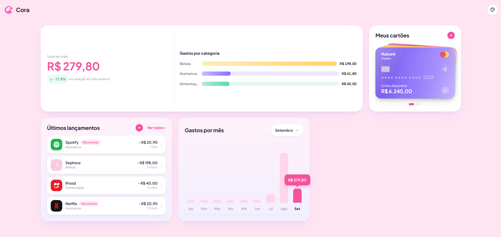
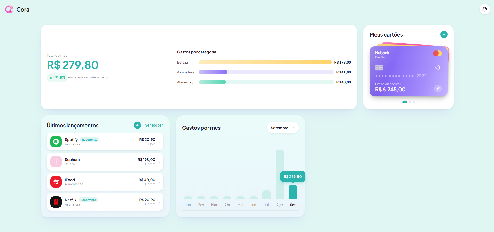
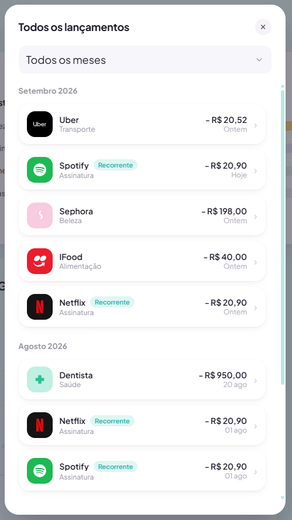

<div align="center">
  <br />
    
  <br />

  <div>
    
    
    
    
    
    
  </div>

  <h3 align="center">Seu controle financeiro, simples e inteligente</h3>
</div>

## 📋 Índice

1. 🤖 [Introdução](#introducao)
2. ⚙️ [Tecnologias](#tecnologias)
3. 🔋 [Funcionalidades](#funcionalidades)
4. 🖼️ [Screenshots](#screenshots)
5. 🤸 [Como rodar](#como-rodar)
6. 📂 [Estrutura do projeto](#estrutura)
7. 🧰 [Scripts](#scripts)

## <a name="introducao">🤖 Introdução</a>

Cora é um dashboard pessoal de finanças: cartões, lançamentos, gastos por mês e resumo por categoria, tudo em um só lugar. Sem planilha, sem depender de serviço externo — os dados ficam salvos localmente, num banco SQLite criado automaticamente pelo próprio backend.

## <a name="tecnologias">⚙️ Tecnologias</a>

- **[React](https://react.dev/)** cuida da interface inteira: cada widget do dashboard (cartões, lançamentos, gráfico, resumo) é um componente independente, com estado controlado a partir de um único ponto (`App.tsx`) pra manter tudo sincronizado.

- **[TypeScript](https://www.typescriptlang.org/)** tipa os dados de ponta a ponta — da resposta da API até as props de cada componente — pra pegar erro em tempo de desenvolvimento, não em produção.

- **[Vite](https://vitejs.dev/)** é o bundler e servidor de desenvolvimento do frontend, com hot reload praticamente instantâneo.

- **[Node.js](https://nodejs.org/)** roda o backend usando só recursos nativos, sem framework pesado por trás.

- **[Express](https://expressjs.com/)** expõe a API REST (cartões, lançamentos, resumo e gastos por mês) consumida pelo frontend.

- **[SQLite](https://www.sqlite.org/)** guarda os dados, acessado via `node:sqlite` — o módulo nativo do Node, sem nenhuma dependência de compilação pra instalar.

## <a name="funcionalidades">🔋 Funcionalidades</a>

👉 **Cartões**: salvos em formato de carteira, com cor e limite editáveis

👉 **Lançamentos**: ícone por marca (Netflix, iFood, Nubank...) ou categoria, com edição e exclusão

👉 **Gastos por mês**: gráfico de barras comparando o total gasto mês a mês

👉 **Resumo por categoria**: total do mês, variação em relação ao mês anterior e distribuição por categoria

👉 **Temas**: paleta de cores trocável na hora, pelo ícone no canto superior direito

Tudo calculado a partir dos lançamentos em tempo real — não existe número solto que possa ficar desincronizado.

## <a name="screenshots">🖼️ Screenshots</a>

<div align="center">
  
  
  <br /><br />
  
</div>

## <a name="como-rodar">🤸 Como rodar</a>

**Pré-requisitos**

- [Node.js](https://nodejs.org/) 22.5 ou mais recente (é a partir dessa versão que o `node:sqlite` existe)

**Clonando o repositório**

```bash
git clone https://github.com/evelynrporto/Cora.git
cd Cora
```

**Instalação**

```bash
npm install
npm install --prefix server
```

**Rodando o projeto**

```bash
npm run dev:all
```

Isso sobe o frontend em `localhost:5173` e a API em `localhost:3001`. Na primeira vez o backend cria o banco sozinho em `server/data/financeapp.db`, vazio — é só começar a usar.

Se preferir rodar cada lado em um terminal separado:

```bash
npm run dev            # frontend
npm run dev:server     # backend
```

## <a name="estrutura">📂 Estrutura do projeto</a>

```
src/            componentes, widgets e libs do frontend
server/         API Express + SQLite
server/data/    banco local, gerado automaticamente e fora do git
```

## <a name="scripts">🧰 Scripts</a>

| Comando | O que faz |
| --- | --- |
| `npm run dev` | só o frontend |
| `npm run dev:server` | só o backend |
| `npm run dev:all` | os dois juntos |
| `npm run build` | type-check + build de produção |
| `npm run lint` | roda o Oxlint |
| `npm run preview` | serve o build localmente |
